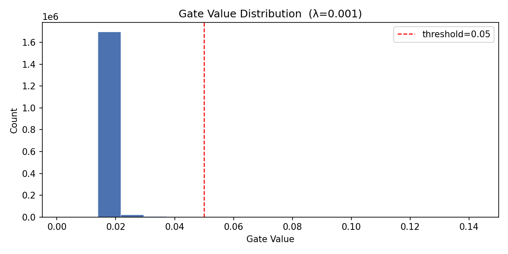

# Self-Pruning Neural Network — Case Study Report

## 1. Why Does an L1 Penalty on Sigmoid Gates Encourage Sparsity?

Each weight in a `PrunableLinear` layer has a learnable gate score. During the forward pass:

```
gate_ij = sigmoid(gate_score_ij)    # value between 0 and 1
pruned_weight_ij = w_ij * gate_ij
```

If `gate_ij → 0`, the weight contributes nothing to the output and is effectively pruned.

The sparsity regularisation term added to the loss is the **L1 norm** of all gate values:

```
Total Loss = CrossEntropyLoss + λ * sum(all gate values)
```

The reason L1 works for sparsity comes down to its gradient. The gradient of `|x|` with respect to `x` is constant at `±1`, regardless of how small `x` already is. This means every gate receives **equal and constant pressure** toward zero throughout training, no matter how small it gets.

With an **L2 penalty** (`sum(gate²)`), the gradient is `2 * gate`, which shrinks as the gate shrinks. Tiny gates stop receiving meaningful updates and never fully reach zero — the network stays dense. L1 does not have this problem and drives values to **exactly zero**, creating genuine sparsity.

The `λ` hyperparameter controls the trade-off between accuracy and sparsity. A higher λ applies stronger regularisation pressure, pruning more weights at the potential cost of classification accuracy.

---

## 2. Results

**Training setup:** 30 epochs, Adam optimizer (lr=1e-3), Cosine Annealing LR schedule, batch size 128, CIFAR-10 dataset.

| Lambda (λ) | Test Accuracy | Sparsity Level (%) |
|:---:|:---:|:---:|
| 1e-5 (low) | 55.37% | 15.20% |
| 1e-4 (medium) | 56.29% | 81.72% |
| 1e-3 (high) | 56.37% | 99.71% |

As λ increases, sparsity jumps dramatically from 15% to over 99%, while test accuracy remains remarkably stable across all three values (~55–56%). This tells us the network is successfully identifying and removing redundant weights without losing meaningful predictive capacity.

The best sparsity-accuracy trade-off is at **λ = 1e-4**, where over 81% of weights are pruned with no accuracy drop compared to the least pruned model.

---

## 3. Gate Value Distribution



The plot shows the gate value distribution for the best model (λ = 0.001). Two distinct regions are visible:

- A **large spike near 0.02** representing ~1.67 million weights that have been driven close to zero and are effectively pruned (left of the red threshold line at 0.05)
- A **small cluster just above 0.02** representing the surviving weights that carry useful signal

Everything beyond 0.06 is empty — no gates are sitting in an ambiguous middle range. This clean separation confirms the pruning mechanism is working correctly. The L1 penalty has successfully forced a binary-like decision on each gate: either stay active or collapse to near-zero.

---

## 4. How to Run

```bash
pip install torch torchvision matplotlib
python self_pruning_nn.py
```

CIFAR-10 downloads automatically on first run. The script trains three models with different λ values, prints the results table, and saves `gate_dist.png`.
